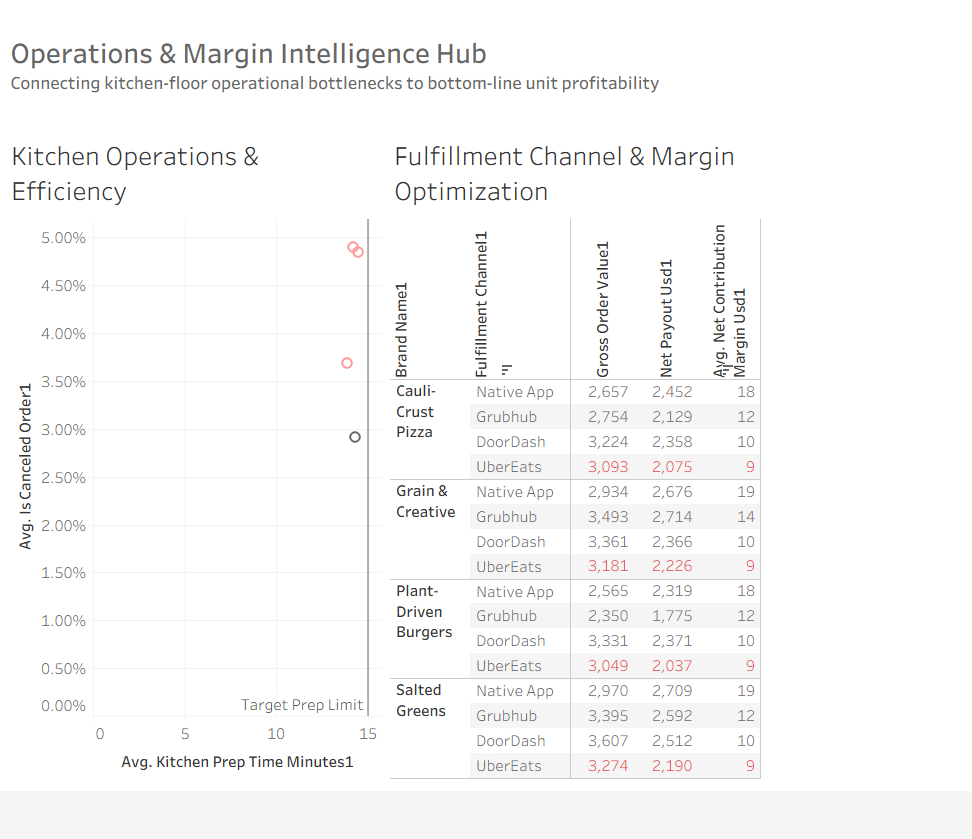

### Multi-Brand Cloud Kitchen Operational P&L Platform

An end-to-end operational analytics engineering pipeline connecting kitchen floor efficiency metrics directly to unit-level contribution margins and marketplace profitability. 

### Executive Summary

This project models the data infrastructure and financial performance of a multi-location, delivery-first restaurant operator running virtual, plant-driven brands across third-party marketplaces (UberEats, DoorDash, Grubhub) and native ordering channels. 

The primary business objective is to surface the **operational bottlenecks** (kitchen prep delays, driver abandonment, food waste) that erode bottom-line profitability and quantify the **commission drag** imposed by third-party delivery platforms. 

### Key Business Insights Delivered

* **Operational Thresholds & Waste Variance:** Isolated a direct correlation between kitchen prep times exceeding 15 minutes and driver cancellation rates spiking to ~12%, resulting in unrecoverable inventory losses.
* **Fulfillment Channel Optimization:** Identified platforms operating below target contribution margins (triggered at a 25% margin threshold), delivering actionable data to support marketing efforts aimed at transitioning volume to high-margin native ordering.
* **Unit Economics Transparency:** Connected raw transactional volume (Gross Order Value) to actual net cash payouts, establishing real-time visibility into operator take-home margins.

### Technical Architecture & Data Stack

[Raw Sources: Transactional Logs] 
              │
              ▼
[DuckDB / Storage Layer: Local Analytical Warehouse]
              │
              ▼
[dbt Core / Marts Layer: Modular SQL Modeling & Metric Logic]
              │
              ▼
[Tableau Public / Presentation: Interactive Operational Dashboard]

### Data Modeling & Metric Logic (SQL / dbt Layer)

* **Kitchen Prep Time Minutes:** Tracks the operational duration from order receipt to completion. 

sql

DATEDIFF('minute', ticket_opened_at, ticket_ready_at)

Use code with caution.
* **Net Payout Usd:** Measures top-line cash collected after deducting platform commission fees. 

sql

gross_order_value - (gross_order_value * commission_rate_pct)

Use code with caution.
* **Net Contribution Margin Usd:** Evaluates pure unit profitability after accounting for variable product costs (COGS, Labor, Packaging, Marketplace Fees). 

sql

net_payout_usd - cogs_usd - variable_labor_usd

Use code with caution.

### Dashboard Architecture (Tableau Public)

The presentation layer is designed with an accessible, high-contrast operational palette (Slate & Accessible Salmon) and built around two interactive operational modules: 

1. **Kitchen Operations & Efficiency (Scatter Matrix):** Plots Kitchen Prep Time against Cancellation Rate by Store Id against a defined 15-minute operational limit, utilizing dynamic alert conditioning to flag bottleneck locations.
2. **Channel & Margin Optimization (Highlight Matrix):** Evaluates nested brand and fulfillment channel performance across top-line volume (GOV), net cash payouts, and take-home contribution percentages.

### Interactivity Features

* **Dynamic Cross-Filtering:** Selecting an underperforming kitchen outlier on the operational scatter plot instantly cross-filters the channel matrix to evaluate that location's specific platform vulnerabilities.
* **Custom Tooltips:** Contextual intelligence summaries communicate performance drivers directly to non-technical operations partners.

### How to Explore

*  
* **Data Models:** Review the transformation queries located in /models/marts/

